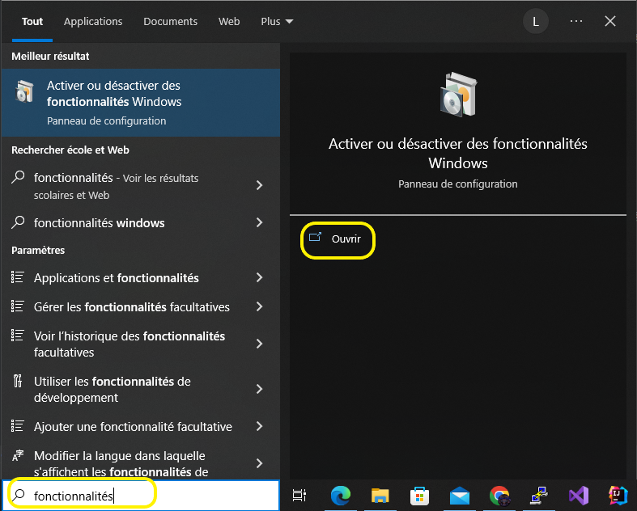
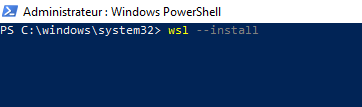
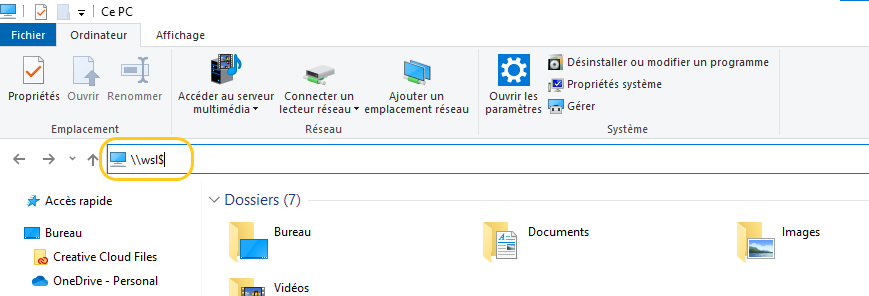

# Installation et configuration du WSL

## Prérequis

- Windows 10 ou 11

## Installation

- Dans la barre de recherche windows, cherchez et ouvrez ```Fonctionnalités de Windows```.

    <details>
      <summary>Illustration</summary>
    
    
    
    </details>


- Vérifier que le ```Sous-système Windows pour linux``` ainsi que ``l'HyperViseur`` sont bien activé.  
S'il n'est pas activé, veuillez cocher la case à gauche et cliquer sur **Ok** (Redémarrez votre PC lorsque windows vous le proposera).  

    <details>
      <summary>Illustration</summary>
    
    
    
    </details>


- Dans la barre de recherche windows, cherchez et ouvrez ```powershell``` en mode **Administrateur**.
    <details>
      <summary>Illustration</summary>
    
    
    
    </details>


- Exécutez la commande suivante : ``wsl --install``
    <details>
      <summary>Illustration</summary>
    
    
    
    </details>


- Ouvrez l'application Ubuntu
  <details>
      <summary>Illustration</summary>

    
    </details>


- La première fois, vous devez créer un utilisateur. Saisissez le nom d'utilisateur et le mot de passe de votre choix.  
(**Au niveau du mot de passe, il est normal que rien n'apparaisse lors de la saisie, mais vos touches sont bien prises en compte**)
    <details>
      <summary>Illustration</summary>
    
    
    
    </details>

**Félicitations ! Vous pouvez à présent accéder au sous système windows pour linux (WSL) quand vous le souhaitez.**

## Comment accéder aux fichiers depuis l'explorer Windows ?

- Ouvrez l'explorateur de fichier et saisissez la route suivante ``\\wsl$`` et appuyez sur ``Entrée``
    <details>
      <summary>Illustration</summary>
    
    
    </details>


- Sélectionnez ensuite le dossier ``Ubuntu``
    <details>
      <summary>Illustration</summary>
    
    
    </details>
    


